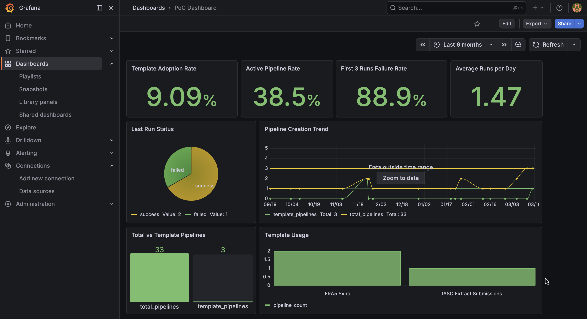

# OpenHexa Templates KPI PoC

## Overview

This project is a **Proof of Concept (PoC)** to monitor the usage and effectiveness of pipeline templates in OpenHexa.



It builds a simple, end-to-end analytics stack that:

* Extracts data from OpenHexa using the official SDK
* Stores it in a PostgreSQL database
* Computes KPIs using SQL views
* Visualizes them in Grafana

---

## Assets

This repository includes ready-to-use assets for quick setup and reproducibility:

* **Grafana Dashboard JSON**: `assets/grafana_dashboard.json`
  → Import this directly into Grafana to instantly recreate the dashboard

* **Dashboard Screenshot**: `assets/dashboard.png`
  → Preview of the final KPI dashboard

---

## Architecture

```text
OpenHexa SDK → ETL (Python) → PostgreSQL → Grafana
```

---

## Objectives

The goal is to answer key business questions:

1. Are users adopting pipeline templates?
2. Do templates help users build pipelines faster?
3. Are templates reliable in production?
4. Are templates trusted over time?

---

## KPIs Implemented

### Adoption

* Template Adoption Rate
* Number of pipelines using templates
* Template usage by template type

### Productivity

* Time to first successful run *(future improvement)*
* Iterations to first success *(future improvement)*

### Reliability

* First 3 runs failure rate
* Last run success status

### Production Usage

* Active pipeline rate (last 30 days)
* Run frequency

---

## Tech Stack

* **Python** – ETL pipeline
* **OpenHexa SDK** – Data extraction
* **PostgreSQL** – Data storage & KPI computation
* **Grafana** – Dashboard & visualization
* **Docker Compose** – Orchestration

---

## Setup Instructions

### 1. Clone the repository

```bash
git clone <your-repo-url>
cd <repo-name>
```

---

### 2. Configure environment variables

Create a `.env` file:

```bash
HEXA_SERVER_URL=https://your-openhexa-instance
HEXA_TOKEN=your_token_here
```

---

### 3. Start the system

```bash
docker-compose up --build
```

This will start:

* PostgreSQL → `localhost:5432`
* Grafana → [http://localhost:3000](http://localhost:3000)
* ETL pipeline (runs automatically)

---

## Data Model

### pipelines

* pipeline_id
* pipeline_code
* name
* type
* workspace_slug
* template_id
* created_at

### pipeline_runs

* run_id
* pipeline_id
* status
* execution_date
* user

---

## KPI Layer (SQL Views)

KPIs are implemented as Postgres views:

* `kpi_adoption_rate`
* `kpi_template_usage`
* `kpi_pipeline_trend`
* `kpi_first_3_failures`
* `kpi_last_run_status`
* `kpi_active_pipeline_rate`
* `kpi_run_frequency`

---

## Grafana Dashboard

### Access Grafana

[http://localhost:3000](http://localhost:3000)

* Username: `admin`
* Password: `admin`

---

### Option 1: Import Pre-built Dashboard (Recommended)

1. Go to **Dashboards → Import**
2. Upload:

```text
assets/grafana_dashboard.json
```

3. Select your PostgreSQL data source
4. Click **Import**

✅ Your full dashboard will be created instantly

---

### Option 2: Manual Setup

1. Add PostgreSQL data source:

   * Host: `postgres:5432`
   * Database: `openhexa_kpis`
   * User: `openhexa`
   * Password: `openhexa`

2. Create dashboard panels using KPI views

---

### Example Queries

**Adoption Rate**

```sql
SELECT adoption_rate FROM kpi_adoption_rate;
```

**Pipeline Trend**

```sql
SELECT date, template_pipelines, total_pipelines
FROM kpi_pipeline_trend;
```

**Failure Rate**

```sql
SELECT AVG(failure_rate) FROM kpi_first_3_failures;
```

---

## ETL Flow

1. Fetch workspaces and pipelines from OpenHexa
2. Extract pipeline details and runs
3. Load into PostgreSQL
4. Create/update KPI views

---

## Known Limitations

* No incremental loading (data is replaced each run)
* Some fields may be null (handled defensively)
* Time-to-success KPIs not yet implemented
* No authentication for Grafana (default credentials)

---

## Future Improvements

* Add incremental ingestion (upserts)
* Add user-level and workspace-level KPIs
* Implement time-to-first-success metric
* Add dbt for transformation layer
* Auto-provision Grafana dashboards
* Add scheduling (cron or Airflow)

---

## Key Learnings

This PoC demonstrates:

* Building a **data pipeline from API → analytics**
* Designing **business-focused KPIs**
* Structuring a **modern data stack**
* Handling **real-world data issues (nulls, types, failures)**

---

## Author

Built as a KPI monitoring PoC for OpenHexa pipeline templates.

**NB:** Part of this README was generated using AI.

